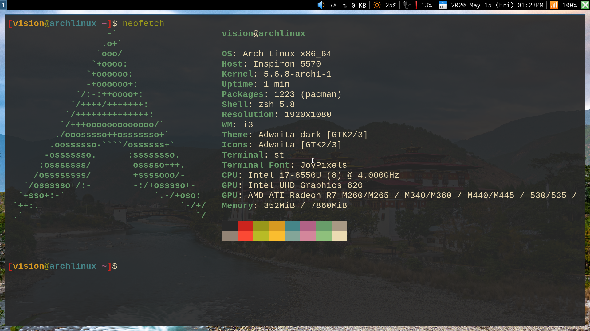

# Network Bandwith Status Bar in [larbs](https://github.com/LukeSmithxyz/LARBS)

Make the following configurations in your system on which larbs is installed. To set a Network Speed Status Bar.


#### ScreenShots




## Set .config/i3blocks/config

Add the following code in the file ./config/i3blocks/config
```
#PATH .config/i3blocks/config

# By Abdhesh Nayak
# Created 2020 May 15

[netBandwidth]
interval=1
command=python ~/.local/bin/statusbar/netBandwidth.py
label=⇅ 
```

## Put a file .local/bin/statusbar/netBandwidth.py

This file present in this repository download and put in the given path.

```
# By Abdhesh Nayak
# Created 2020 May 15

import time
import psutil
def main():
    old_value = 0    

    new_value = psutil.net_io_counters().bytes_sent + psutil.net_io_counters().bytes_recv
    send_stat(new_value)

def convert_to_kbit(value):
    return value/1024.*8

def send_stat(value):
    try:
        f = open("speed.txt", "r")
        old_val=f.read()
    except IOError:
        old_val="0"
        pass

    new_val="%0.0f" % convert_to_kbit(value)
    f = open("speed.txt", "w")
    f.write(new_val)
    f.close()
    print ("%d KB" % (int(new_val)-int(old_val)))
main()
```
now yourare done your task.. now you you can see the result in your status bar by refreshing the screen or when you will log in next time to your i3-Session. 
## Author
* **Abdhesh Nayak** - [Github](https://github.com/abdheshnayak), [LinkedIn](https://www.linkedin.com/in/abdhesh-nayak/)

See also the list of [contributors](https://github.com/abdheshnayak/larbs-netBandwith-statusbar/graphs/contributors) who participated in this project.
